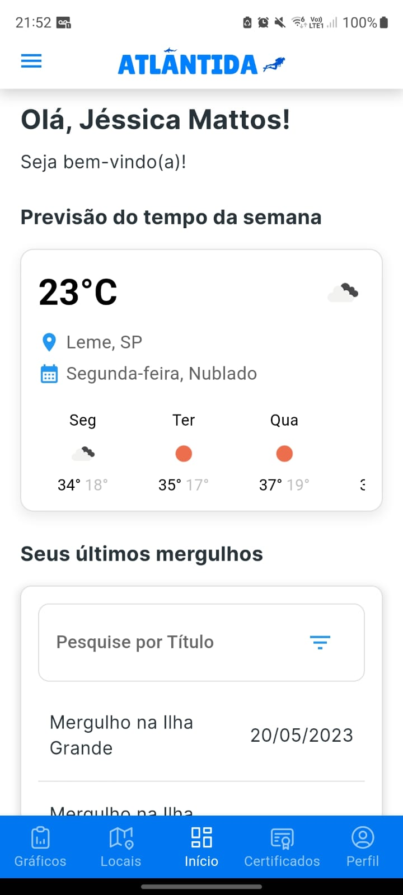
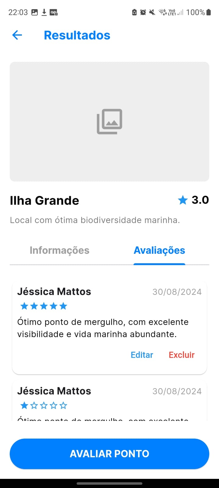
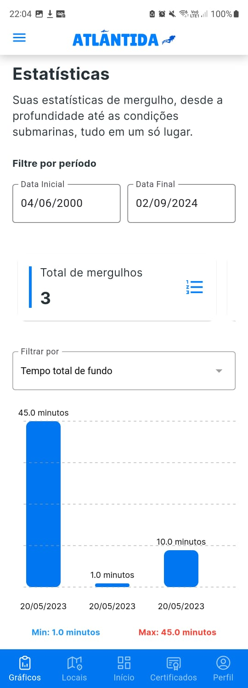

# Atlântida Mobile

Atlântida Mobile é um projeto Flutter destinado ao gerenciamento e otimização da experiência de mergulho. Este aplicativo oferece uma plataforma completa para gerenciar mergulhos, locais de mergulho, avaliações e certificados de mergulho.

## Funcionalidades

O aplicativo **Atlântida Mobile** possui as seguintes funcionalidades:

1. **Cadastro de Usuários**: Permite que novos usuários se registrem na plataforma.
2. **Login de Usuários**: Facilita o acesso dos usuários ao sistema por meio de um login seguro.
3. **Registro de Mergulhos**: Usuários podem registrar informações detalhadas sobre suas imersões.
4. **Cadastro de Locais de Mergulho**: Permite que os usuários adicionem novos pontos de mergulho ao sistema.
5. **Avaliações de Locais de Mergulho**: Usuários podem avaliar os locais de mergulho e compartilhar suas experiências.
6. **Visualização de Mapas**: Oferece mapas interativos com a localização dos locais de mergulho.
7. **Cadastro de Certificados**: Usuários podem registrar e gerenciar seus certificados de mergulho.
8. **Edição de Perfis**: Permite que os usuários atualizem suas informações pessoais e preferências.
9. **Visualização de Estatísticas**: Fornece estatísticas detalhadas sobre os mergulhos dos usuários.
10. **Filtragem de Registros**: Usuários podem filtrar e visualizar registros de mergulho por período ou região.

## Tecnologias Utilizadas

- **Flutter**: Framework para desenvolvimento de aplicativos móveis.
- **Dart**: Linguagem de programação utilizada pelo Flutter.
- **Google Maps API**: Para a visualização de mapas e localização de mergulhos.

- **[Atlântida API](https://github.com/JessicaMMattos/atlantida-api)**: API utilizada para armazenar e retornar dados sobre mergulhos, locais de mergulho, usuários e certificados. O aplicativo móvel faz requisições para esta API para obter e enviar dados.

## Imagens do Aplicativo

### Tela Inicial

### Tela de Mapas

### Tela de Comentários dos Pontos de Mergulho

### Tela de Estatisticas dos mergulhos

## Licença

Este projeto é licenciado sob uma licença privada.
